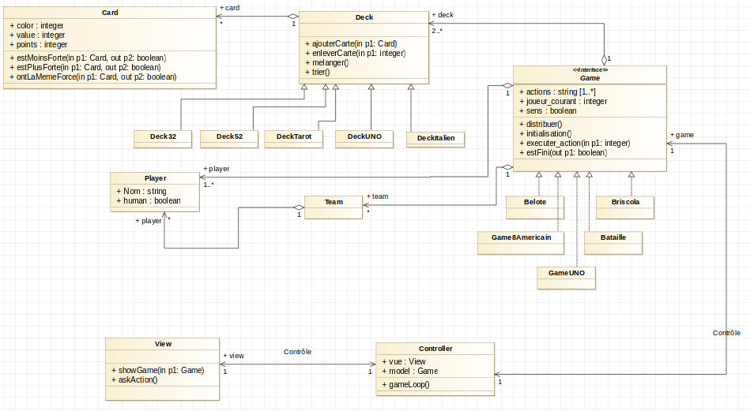

# Framework jeux de cartes   

    

*Projet réalisé en binôme dans le cadre du cours "Langages à Objets Avancés"*   
**Auteurs : [Joël Hamilcaro](https://github.com/Joel-Hamilcaro/) et [Jie Tu](https://github.com/jie-tu)**

## Résumé

Dans le cadre du cours de M1, Langages à Objets avancés,
nous avons développé un Framework de jeux de cartes en langage C++. Ce document est le rapport de ce projet. Il a pour but d’expliquer nos choix de conception et l’approche utilisée, de
présenter les fonctionnalités qui ont été implémentés, et enfin, proposer quelques pistes d’améliorations.

## Modélisation et choix de conception

### 1 – Les classes d’objets essentiels

Dans un premier temps, nous devions mettre en place un modèle qui
nous permettait de programmer un framework de jeux de cartes de manière
astucieuse. Il fallait d’abord distinguer les points communs et les différences
globales entres les jeux de cartes comme ceux qui nous étaient proposées
par l’énoncé afin d’y extraire des "briques fonctionnelles" communes aux
jeux de cartes.

#### 1.1 – Les cartes
De manière évidente, tous ces jeux utilisent des cartes. Peu importe le
type de carte (cartes de UNO, cartes françaises,italiennes...), elles ont toutes
ces critères en communs : une carte a une valeur et une couleur. De plus,
dans beaucoup de jeu de cartes, on retrouve la notion de "force" d’une carte,
(par exemple, dans l’As est plus fort que les autres cartes dans le jeu de la
Bataille, une carte vaut un certain nombre de points à la Belote...). Nous
avons donc décider de modéliser les cartes par une classe "Carte" dont
chaque instance possède trois attributs (la valeur, la couleur et le troisième
attribut qu’on appelle "point").

#### 1.2 – Les paquets de cartes
De plus, nous avons choisi de créer une classe d’objets "Deck" qui re-
présente un paquet de cartes. En effet, le concept de "paquet de cartes" est
essentiel dans un jeu de cartes. Par exemple, les cartes possédées par les
joueurs constituent un paquet, les cartes défaussées par les joueurs forment4
un paquet, la "pioche" est elle-même un paquet de carte, ... On peut voir, à
travers ces quelques exemples, que le fait de regrouper les cartes par paquets
est fondamental dans les jeux de cartes. Ainsi, il fallait que notre framework
puisse manipuler des cartes par paquets.

#### 1.3 – Les joueurs
Dans tous les jeux de cartes, il y a au moins un joueur. Ces joueurs ont
leur propre paquet de cartes ("la main"), le joueur peut être un humain ou
une IA. Le nombre de joueurs n’est pas le même d’un jeu à l’autre. C’est
pourquoi nous avons décider de créer une classe "Joueur" afin que notre
framework puisse paramétrer et accéder facilement aux caractéristiques
des Joueurs constituant le jeu (quel est le nombre de joueurs, quelles cartes
possède tel joueur à tel moment ...).

#### 1.4 – Les jeux
En outre, il est important de remarquer que les jeux en eux-même consti-
tuent une classe d’objet du framework. Les jeux de cartes ont des attributs
communs : ils ont des joueurs, ils ont différents paquets de cartes (comme
la pioche, la "pose"/"défausse", ... ). De plus, lors du développement d’un
jeu de cartes, il faut toujours définir une manière d’initialiser le jeu (com-
ment les cartes sont distribuées, quel joueur va commencer, ...etc), définir
comment se déroule le jeu suite à une action des joueur, définir comment
le jeu se termine ... etc. Néanmoins, c’est à l’utilisateur du framework de dé-
terminer toutes ces caractéristiques. Ainsi, nous avons décidé de modéliser
la classe d’objets "Jeu" comme une classe abstraite, possédant toutes ces
caractéristiques communes, et possédant ces fonctions abstraites, à définir
pour chaque jeu.

#### 1.5 – La Vue et le Controleur
Enfin, les deux dernières briques fonctionnelles essentielles de notre
framework sont les classes d’objets "Vue" et "Contrôleur". En effet, pour
chaque jeu, l’utilisateur humain doit pouvoir interagir avec la machine afin
de transmettre ses décisions d’actions dans jeu. Nous avons donc utilisé
le design pattern MVC (Modèle-Vue-Contrôleur) afin de séparer le coeur
fonctionnel du jeu et l’interface utilisateur.

### 2 – Les classes d’objets utiles
Dans un second temps, nous avons décidé de concevoir des classes
d’objets utiles, pas forcément essentielles, mais très pertinentes dans le
cadre du développement d’un framework. En effet, l’idée du framework est
de faciliter de manière significative la conception d’un jeu de cartes. Par
conséquent, nous avons choisi d’intégrer à notre framework des outils de
conception de jeu de cartes.

#### 2.1 – Les équipes
Certains jeux de cartes se jouent par équipe. Bien qu’il est possible de
définir ce qu’est une équipe à chaque fois que l’on programme un nouveau
jeu, nous avons choisi de le définir nous-même dans notre framework en
tant qu’une classe d’objet. Cela permet de simplifier la conception des jeux
par équipes.

#### 2.2 – Les paquets de cartes connus
La plupart des jeux de cartes utilisent des paquets de cartes connus (jeu
de 32 cartes, jeu de 52 cartes, ...). Ainsi, pour simplifier le développement
de chaque jeu de cartes, nous avons défini les classes d’objets suivantes, en
tant que spécialisation de la classe d’objet "paquet de cartes".
— Jeu de 32 cartes
— Jeu de cartes italiennes
— Jeu de 52 cartes
— Jeu de 52 cartes (avec un Joker)
— Jeu de 52 cartes (avec deux Joker)
— Jeu de 56 cartes (jeu de 52 cartes avec cavaliers)
— Jeu de 56 cartes (avec un Joker)
— Jeu de 56 cartes (avec deux Joker)
— Jeu de Tarot
— Jeu de UNO
Notons que certains de paquets de cartes ne sont pas nécessaires pour les
jeux proposées par l’énoncé. Mais nous avons conçu le framework comme
un framework généraliste pour jeux de cartes. Dans cette logique, nous
proposons plusieurs bibliothèques de paquets de cartes connus disponibles.6

#### 2.3 – Diagramme UML

Tous ces choix précédents nous ont amené à faire la modélisation que
nous avons représenté sur notre diagramme UML. Ce diagramme UML est
disponible dans le dossier du dépôt.



## Implémentation

### 1 – Jeux implémentés

Nous avons implémenté les jeux suivants :
— Bataille
— Briscola
— Belote
— 8 américain
— UNO

### 2 – Choix d’implémentation
Notre but était que le framework facilite au maximum la programma-
tion des jeux de cartes. Ainsi, nous avons conçu le framework de telle sorte
que, pour programmer un nouveau jeu de cartes, il suffit uniquement de
créer une classe héritant de Game et de surcharger toutes les méthodes
virtuelles pures. La boucle de jeu, l’intelligence artificielle, l’affichage, l’in-
teraction entre l’utilisateur-machine est entièrement gérée par le contrôleur
et la vue. La fonction principale d’un jeu devient alors très concise (3 à
5 lignes) comme le montre les classes mainBataille.cpp mainBelote.cpp
mainUNO.cpp main8americain.cpp .

### 3 – Choix techniques particuliers

#### 3.1 – Surcharge d’opérateurs
Nous avons utilisé la surcharge d’opérateur pour les classes Card et Deck,
notamment pour comparer la force des cartes entre elles ( < > == ... ) et pour
les opérations d’ajouts de cartes dans un Deck (+, +=)8

#### 3.2 – Généricité
Nous avons utilisé la généricité pour les classes View et Controller. Un
contrôleur et une Vue prennent un modèle comme attribut, ce modèle est
d’un type générique "concret" héritant du type abstrait Game

#### 3.3 – Exceptions
Nous utilisons les exceptions pour des cas très particuliers, (par exemple
on lance une exception pour l’affichage d’une carte dont la valeur n’est pas
"possible", ou si le controleur ou la vue sont initialisés avec un paramètre
générique dont le type n’hérite pas de Game...)

## Bilan et pistes d’améliorations  

Ainsi, à travers l’implémentation de 5 jeux de cartes différents, nous
avons illustré que ce framework fonctionne bien. Pour implémenter un
jeu de cartes à partir du framework, il suffit de créer un classe héritant
de Game et de redéfinir toutes les fonctions virtuelles pures car tout le
reste (la boucle de jeu, l’affichage, les interaction utilisateurs, l’IA...) est déjà
géré par la vue et le contrôleur. Donc, nous avons rempli notre objectif de
programmer notre framework de manière à ce qu’elle facilite au maximum
la programmation des jeux de cartes. Nous pouvons à partir de ce framework
programmer les autres jeux de cartes proposées par l’énoncé, mais aussi
beaucoup d’autres jeux de cartes. De plus le design pattern MVC nous
permettrait, sans modifier notre modèle, de programmer un autre type de
vue qui utiliserait des interfaces graphiques.

## Annexe

### Compiler le programme

- Dans *src/*
- Compiler tout les jeux en même temps
```
make
```

- Compiler le jeu 'NOMDUJEU'
```
make mainNOMDUJEU
```
Par exemple pour Briscola :
```
make mainBriscola
```

### Lancer le programme

- Lancer
```
./mainNOMDUJEU
```
Par exemple pour Briscola :
```
./mainBriscola
```

- Nettoyer
```
make clean
```
- Tester les fuites de mémoire sur un jeu
```
make valgrindNOMDUJEU
```

- Les tests unitaires de Decks sont dans main.cpp
